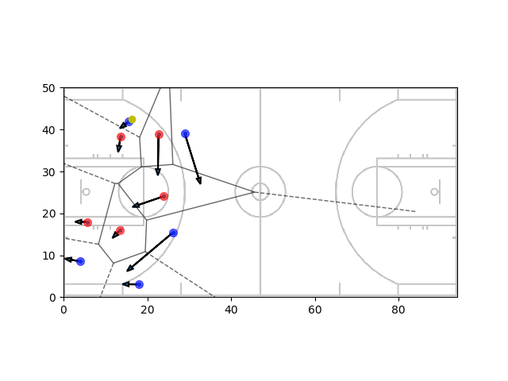
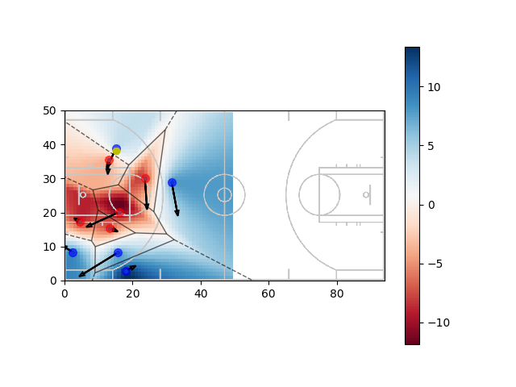

# Découpage du terrain 

## Introduction

On s'intéresse à l'occupation du terrain par les défenseurs et les attaquants. On ne prend pas en compte la position du ballon. On va chercher à découper le terrain en zone dans le but de déterminer des zones où les attaquants pourraient faire une passe en ayant une bonne chance de garder la balle sans prendre en compte la position de la balle.

## Diagrammes de Voronoï

La première idée pour découper le terrain consiste à utiliser les diagrammes de Voronoï. Ces diagrammes découpent un plan en cellules à partir d'un ensemble de point appelés germes. Chaque cellule enferme un seul germe, et forme l'ensemble des points du plan plus proches de ce germe que de tous les autres. 

Dans notre cas les germes sont les joueurs. On peut donc découper le terrain en associant à chaque joueur une zone lui appartenant. La figure 1 illustre ce découpage.

<table border="2">
  <tr>
    <td>
      
    </td>
  </tr>
</table>

## Valuation de l'espace

Les diagrammes de Voronoï permettent une première approche simple pour le découpage de l'espace. Cependant au sein d'une zone associée à un joueur celui-ci contrôle plus les points proches de lui que les points loin. On va chercher donc à donner une valeur de contrôle par les joueurs à chaque espace du terrain. Notre démarche est la suivante :
- on découpe le terrain en petites cellules
- pour chaque cellule on calcule temps que chaque joueur met pour rejoindre cette zone avec une vitesse v donnée identique pour tous les joueurs. 
- on cherche l'attaquant et le défenseur qui arrive le plus vite à ce point en conservant leur temps respectif qu'on note tmin def et t_min_att.
- on associe à cette zone la valeur val=t_min_def-t_min_att

Ainsi plus un attaquant peut arriver vite par rapport aux défenseurs à une cellule, plus il contrôle celle-ci, plus la quantité val est grande. La figure suivante permet d'illustrer la valuation de l'espace en terme de contrôle.

<table border="2">
  <tr>
    <td>
      
    </td>
  </tr>
</table>

## Influence de l'inertie sur les espaces de Voronoï

Sur la figure précédente les vecteurs vitesses des joueurs sont représentés par les flèches bleues. De manière intuitive on comprend que le contrôle de l'espace par les joueurs est influencé par cette vitesse. Nous allons donc prendre en compte ceci dans la suite. 

Pour prendre en compte l'influence de l'inertie nous devons changer notre façon de calculer le temps qu'un joueur met pour rejoindre un point. Le principe du calcul repose sur l'idée que les joueurs utilise une force de norme constante et dont la direction dépend de la vitesse initiale pour leur permettre rejoindre un point donné. Le détail du calcul est présenté dans le document [Closest player to a point] (https://github.com/AmigoCap/MecaFootCo/blob/master/Travail_autour_de_la_prediction_de_passes/Closest_player_to_a_point.pdf).

